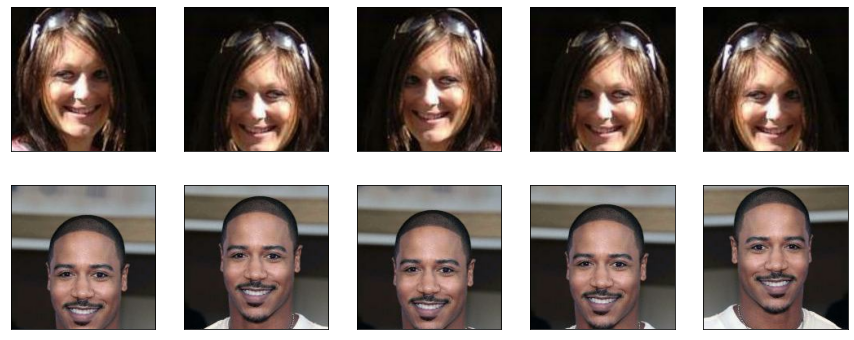
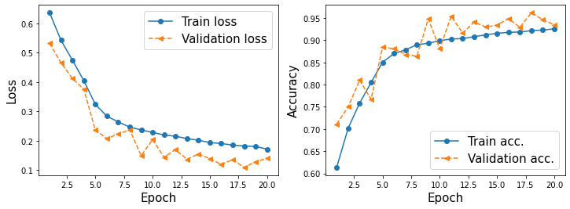
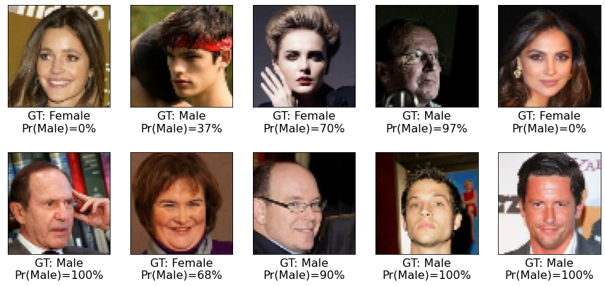

# 합성곱 신경망을 사용하여 얼굴 이미지의 성별 분류

## CelebA 데이터셋에 있는 얼굴 이미지의 성별을 분류

* 20만 2599개의 유명 인사 얼굴 이미지

* 각 이미지마다 얼굴에 대한 특징 40개를 True/False로 제공
  
  * 성별(남성, 여성), 나이(젊은이, 노인)가 포함되어있음

* 훈련데이터의 일부(1만6000개)만 사용

* 과대적합을 막기위한 Data Augmentation기법 사용

### CelebA Dataset Load

```python
import tensorflow as tf
import tensorflow_datasets as tfds
```

```python
## 데이터 셋의 sample개수를 세는 함수
def count_items(ds):
    n = 0
    for _ in ds:
        n += 1
    return n
```

```python
celeba_bldr = tfds.builder('celeb_a')
celeba_bldr.download_and_prepare()
celeba = celeba_bldr.as_dataset(shuffle_files=False)
celeba_train = celeba['train']
celeba_valid = celeba['validation']
celeba_test = celeba['test']
```

    Downloading and preparing dataset Unknown size (download: Unknown size, generated: Unknown size, total: Unknown size) to ~\tensorflow_datasets\celeb_a\2.0.1...
    
    
    
    Dl Completed...: 0 url [00:00, ? url/s]
    
    
    
    Dl Size...: 0 MiB [00:00, ? MiB/s]
    
    
    
    Generating splits...:   0%|          | 0/3 [00:00<?, ? splits/s]
    
    
    
    Generating train examples...: 0 examples [00:00, ? examples/s]
    
    
    
    Shuffling ~\tensorflow_datasets\celeb_a\2.0.1.incompleteH4A75F\celeb_a-train.tfrecord*...:   0%|          | 0/…
    
    
    
    Generating validation examples...: 0 examples [00:00, ? examples/s]
    
    
    
    Shuffling ~\tensorflow_datasets\celeb_a\2.0.1.incompleteH4A75F\celeb_a-validation.tfrecord*...:   0%|         …
    
    
    
    Generating test examples...: 0 examples [00:00, ? examples/s]
    
    
    
    Shuffling ~\tensorflow_datasets\celeb_a\2.0.1.incompleteH4A75F\celeb_a-test.tfrecord*...:   0%|          | 0/1…
    
    
    Dataset celeb_a downloaded and prepared to ~\tensorflow_datasets\celeb_a\2.0.1. Subsequent calls will reuse this data.
    dict_keys([Split('train'), Split('validation'), Split('test')])

전체 훈련 데이터와 검증 데이터를 모두 사용하는 대신 16,000개의 훈련 샘플과 검증용으로 1,000개의 샘플만 사용

```python
celeba_train = celeba_train.take(16000)
celeba_valid = celeba_valid.take(1000)

print('훈련 데이터셋: {}'.format(count_items(celeba_train)))
print('검증 데이터셋: {}'.format(count_items(celeba_valid)))
```

    훈련 데이터셋: 16000
    검증 데이터셋: 1000

### 이미지 변환과 데이터 증식

* 이미지를 잘라내거나 뒤집거나 대비, 명도, 채도를 바꿀 수 있다.
* tf.image모듈을 활용
1. 이미지를 잘라내기
2. 이미지를 수평으로 뒤집기
3. 대비 조정하기
4. 명도 조정하기
5. 이미지 중앙부를 잘라서 원본이미지크기(218, 178)로 확대하기

### Data Augmentation

```python
def preprocess(example, size=(64, 64), mode='train'):
    image = example['image']
    label = example['attributes']['Male']
    ## augmentation은 학습에만 사용
    if mode == 'train':
        image_cropped = tf.image.random_crop(
            image, size=(178, 178, 3))
        image_resized = tf.image.resize(
            image_cropped, size=size)
        image_flip = tf.image.random_flip_left_right(
            image_resized)
        return (image_flip/255.0, tf.cast(label, tf.int32))

    else:
        image_cropped = tf.image.crop_to_bounding_box(
            image, offset_height=20, offset_width=0,
            target_height=178, target_width=178)
        image_resized = tf.image.resize(
            image_cropped, size=size)
        return (image_resized/255.0, tf.cast(label, tf.int32))
```

```python
import matplotlib.pyplot as plt
tf.random.set_seed(1)

ds = celeba_train.shuffle(1000, reshuffle_each_iteration=False)
ds = ds.take(2).repeat(5)

ds = ds.map(lambda x:preprocess(x, size=(178, 178), mode='train'))

## 2개의 이미지를 5번 augmentation한 결과
fig = plt.figure(figsize=(15, 6))
for j,example in enumerate(ds):
    ax = fig.add_subplot(2, 5, j//2+(j%2)*5+1)
    ax.set_xticks([])
    ax.set_yticks([])
    ax.imshow(example[0])

plt.show()
```



```python
import numpy as np
## 데이터 셋 정의
BATCH_SIZE = 32
BUFFER_SIZE = 1000
IMAGE_SIZE = (64, 64)
steps_per_epoch = np.ceil(16000/BATCH_SIZE)

print(steps_per_epoch)
```

    500.0

```python
ds_train = celeba_train.map(lambda x: preprocess(x, size=IMAGE_SIZE, mode='train'))
ds_train = ds_train.shuffle(buffer_size=BUFFER_SIZE).repeat()
ds_train = ds_train.batch(BATCH_SIZE)

ds_valid = celeba_valid.map(lambda x: preprocess(x, size=IMAGE_SIZE, mode='eval'))
ds_valid = ds_valid.shuffle(buffer_size=BUFFER_SIZE)
ds_valid = ds_valid.batch(BATCH_SIZE)
```

### Model

```python
class MyModel(tf.keras.Model):
    def __init__(self):
        super(MyModel, self).__init__()

        self.conv1 = tf.keras.layers.Conv2D(32, (3,3), padding='same', activation='relu')
        self.pool1 = tf.keras.layers.MaxPool2D((2,2))
        self.drop1 = tf.keras.layers.Dropout(0.5)

        self.conv2 = tf.keras.layers.Conv2D(64, (3,3), padding='same', activation='relu')
        self.pool2 = tf.keras.layers.MaxPool2D((2,2))
        self.drop2 = tf.keras.layers.Dropout(0.5)

        self.conv3 = tf.keras.layers.Conv2D(128, (3,3), padding='same', activation='relu')
        self.pool3 = tf.keras.layers.MaxPool2D((2,2))

        self.conv4 = tf.keras.layers.Conv2D(256, (3,3), padding='same', activation='relu')
        self.pool4 = tf.keras.layers.GlobalAveragePooling2D()

        self.dense1 = tf.keras.layers.Dense(1, activation=None)

    def call(self, input_tensor):
        x = self.conv1(input_tensor)
        x = self.pool1(x)
        x = self.drop1(x)

        x = self.conv2(x)
        x = self.pool2(x)
        x = self.drop2(x)

        x = self.conv3(x)
        x = self.pool3(x)

        x = self.conv4(x)
        x = self.pool4(x)
        return self.dense1(x)
```

```python
tf.random.set_seed(1)
input_shape=(None, 64, 64, 3)
model = MyModel()
model.build(input_shape=input_shape)

model.summary()
```

    Model: "my_model_3"
    _________________________________________________________________
    Layer (type)                 Output Shape              Param #   
    =================================================================
    conv2d_12 (Conv2D)           multiple                  896       
    _________________________________________________________________
    max_pooling2d_9 (MaxPooling2 multiple                  0         
    _________________________________________________________________
    dropout_6 (Dropout)          multiple                  0         
    _________________________________________________________________
    conv2d_13 (Conv2D)           multiple                  18496     
    _________________________________________________________________
    max_pooling2d_10 (MaxPooling multiple                  0         
    _________________________________________________________________
    dropout_7 (Dropout)          multiple                  0         
    _________________________________________________________________
    conv2d_14 (Conv2D)           multiple                  73856     
    _________________________________________________________________
    max_pooling2d_11 (MaxPooling multiple                  0         
    _________________________________________________________________
    conv2d_15 (Conv2D)           multiple                  295168    
    _________________________________________________________________
    global_average_pooling2d_3 ( multiple                  0         
    _________________________________________________________________
    dense_3 (Dense)              multiple                  257       
    =================================================================
    Total params: 388,673
    Trainable params: 388,673
    Non-trainable params: 0
    _________________________________________________________________

#### Global average-pooling

* [batch x 64 x 64 x 8]크기의 특성맵 -> [batch x 8]의 크기로 변한다

```python
model.compile(optimizer=tf.keras.optimizers.Adam(),
              ## 마지막 층에 activation=None로 시그모이드 활성화를 하지 않아서 모델의 출력이 로짓이다.
              ## from_logits을 적용하면 손실함수가 내부적으로 시그모이드 함수를 적용
              loss=tf.keras.losses.BinaryCrossentropy(from_logits=True), 
              metrics=['accuracy'])
```

### Training

```python
history = model.fit(ds_train, validation_data=ds_valid, 
                    epochs=30, steps_per_epoch=steps_per_epoch)
```

    Epoch 1/30
    500/500 [==============================] - 8s 15ms/step - loss: 0.1714 - accuracy: 0.9237 - val_loss: 0.1210 - val_accuracy: 0.9460
    Epoch 2/30
    500/500 [==============================] - 8s 15ms/step - loss: 0.1680 - accuracy: 0.9291 - val_loss: 0.1024 - val_accuracy: 0.9630
    Epoch 3/30
    500/500 [==============================] - 8s 15ms/step - loss: 0.1629 - accuracy: 0.9310 - val_loss: 0.1110 - val_accuracy: 0.9470
    Epoch 4/30
    500/500 [==============================] - 8s 15ms/step - loss: 0.1615 - accuracy: 0.9308 - val_loss: 0.1113 - val_accuracy: 0.9510
    Epoch 5/30
    500/500 [==============================] - 8s 15ms/step - loss: 0.1646 - accuracy: 0.9302 - val_loss: 0.1262 - val_accuracy: 0.9370
    Epoch 6/30
    500/500 [==============================] - 7s 15ms/step - loss: 0.1564 - accuracy: 0.9338 - val_loss: 0.1091 - val_accuracy: 0.9630
    Epoch 7/30
    500/500 [==============================] - 7s 15ms/step - loss: 0.1548 - accuracy: 0.9333 - val_loss: 0.1177 - val_accuracy: 0.9530
    Epoch 8/30
    500/500 [==============================] - 8s 15ms/step - loss: 0.1519 - accuracy: 0.9342 - val_loss: 0.1645 - val_accuracy: 0.9120
    Epoch 9/30
    500/500 [==============================] - 7s 15ms/step - loss: 0.1452 - accuracy: 0.9394 - val_loss: 0.1058 - val_accuracy: 0.9540
    Epoch 10/30
    500/500 [==============================] - 7s 15ms/step - loss: 0.1482 - accuracy: 0.9361 - val_loss: 0.1169 - val_accuracy: 0.9510
    Epoch 11/30
    500/500 [==============================] - 7s 15ms/step - loss: 0.1441 - accuracy: 0.9417 - val_loss: 0.1044 - val_accuracy: 0.9590
    Epoch 12/30
    500/500 [==============================] - 8s 15ms/step - loss: 0.1427 - accuracy: 0.9392 - val_loss: 0.1122 - val_accuracy: 0.9490
    Epoch 13/30
    500/500 [==============================] - 7s 15ms/step - loss: 0.1409 - accuracy: 0.9404 - val_loss: 0.1073 - val_accuracy: 0.9530
    Epoch 14/30
    500/500 [==============================] - 7s 15ms/step - loss: 0.1385 - accuracy: 0.9424 - val_loss: 0.1056 - val_accuracy: 0.9600
    Epoch 15/30
    500/500 [==============================] - 7s 15ms/step - loss: 0.1400 - accuracy: 0.9421 - val_loss: 0.1142 - val_accuracy: 0.9490
    Epoch 16/30
    500/500 [==============================] - 8s 15ms/step - loss: 0.1337 - accuracy: 0.9423 - val_loss: 0.0989 - val_accuracy: 0.9650
    Epoch 17/30
    500/500 [==============================] - 8s 15ms/step - loss: 0.1389 - accuracy: 0.9414 - val_loss: 0.1052 - val_accuracy: 0.9590
    Epoch 18/30
    500/500 [==============================] - 8s 15ms/step - loss: 0.1320 - accuracy: 0.9438 - val_loss: 0.0926 - val_accuracy: 0.9710
    Epoch 19/30
    500/500 [==============================] - 8s 15ms/step - loss: 0.1290 - accuracy: 0.9476 - val_loss: 0.1000 - val_accuracy: 0.9610
    Epoch 20/30
    500/500 [==============================] - 8s 15ms/step - loss: 0.1276 - accuracy: 0.9446 - val_loss: 0.1070 - val_accuracy: 0.9600
    Epoch 21/30
    500/500 [==============================] - 8s 15ms/step - loss: 0.1301 - accuracy: 0.9446 - val_loss: 0.1237 - val_accuracy: 0.9450
    Epoch 22/30
    500/500 [==============================] - 7s 15ms/step - loss: 0.1287 - accuracy: 0.9454 - val_loss: 0.0941 - val_accuracy: 0.9670
    Epoch 23/30
    500/500 [==============================] - 7s 15ms/step - loss: 0.1251 - accuracy: 0.9492 - val_loss: 0.1041 - val_accuracy: 0.9510
    Epoch 24/30
    500/500 [==============================] - 8s 15ms/step - loss: 0.1227 - accuracy: 0.9482 - val_loss: 0.0963 - val_accuracy: 0.9660
    Epoch 25/30
    500/500 [==============================] - 8s 15ms/step - loss: 0.1249 - accuracy: 0.9473 - val_loss: 0.0979 - val_accuracy: 0.9640
    Epoch 26/30
    500/500 [==============================] - 7s 15ms/step - loss: 0.1238 - accuracy: 0.9486 - val_loss: 0.0967 - val_accuracy: 0.9570
    Epoch 27/30
    500/500 [==============================] - 8s 15ms/step - loss: 0.1188 - accuracy: 0.9514 - val_loss: 0.1021 - val_accuracy: 0.9580
    Epoch 28/30
    500/500 [==============================] - 7s 15ms/step - loss: 0.1207 - accuracy: 0.9499 - val_loss: 0.1102 - val_accuracy: 0.9600
    Epoch 29/30
    500/500 [==============================] - 8s 15ms/step - loss: 0.1167 - accuracy: 0.9517 - val_loss: 0.0992 - val_accuracy: 0.9640
    Epoch 30/30
    500/500 [==============================] - 8s 15ms/step - loss: 0.1184 - accuracy: 0.9507 - val_loss: 0.1023 - val_accuracy: 0.9690

```python
hist = history.history
x_arr = np.arange(len(hist['loss'])) + 1

fig = plt.figure(figsize=(12, 4))
ax = fig.add_subplot(1, 2, 1)
ax.plot(x_arr, hist['loss'], '-o', label='Train loss')
ax.plot(x_arr, hist['val_loss'], '--<', label='Validation loss')
ax.legend(fontsize=15)
ax.set_xlabel('Epoch', size=15)
ax.set_ylabel('Loss', size=15)

ax = fig.add_subplot(1, 2, 2)
ax.plot(x_arr, hist['accuracy'], '-o', label='Train acc.')
ax.plot(x_arr, hist['val_accuracy'], '--<', label='Validation acc.')
ax.legend(fontsize=15)
ax.set_xlabel('Epoch', size=15)
ax.set_ylabel('Accuracy', size=15)

plt.show()
```



### Test

```python
ds_test = celeba_test.map(
    lambda x:preprocess(x, size=IMAGE_SIZE, mode='eval')).batch(32)
results = model.evaluate(ds_test, verbose=0)
print('테스트 정확도: {:.2f}%'.format(results[1]*100))
```

    테스트 정확도: 96.04%

```python
ds = ds_test.unbatch().take(10) ## unbatch를 해야 take()을 했을 때 32개가 아닌 10개를 가져옴

pred_logits = model.predict(ds.batch(10))
probas = tf.sigmoid(pred_logits) ## sigmoid를 이용해 class확률 계산
probas = probas.numpy().flatten()*100

fig = plt.figure(figsize=(15,7))
for j, example in enumerate(ds):
    ax = fig.add_subplot(2, 5, j+1)
    ax.set_xticks([]); ax.set_yticks([])
    ax.imshow(example[0])
    if example[1].numpy() == 1:
        label='Male'
    else:
        label='Female'
    ax.text(0.5, -0.15, 'GT: {:s}\nPr(Male)={:.0f}%'.format(label, probas[j]), size=16,
           horizontalalignment='center',
           verticalalignment='center',
           transform=ax.transAxes)

plt.show()
```



### PLUS

* 드롭아웃확률과 합성곱 층의 필터 개수를 변경하거나 globalaveragepooling을 flatten으로 바꿀수도있다.
* 참고: 머신러닝 교과서 with 파이썬, 사이킷런, 텐서플로 개정3판